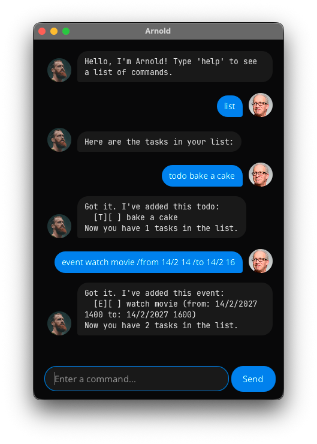

# Arnold User Guide

Arnold is a friendly task management chatbot that helps you keep track of your todos, deadlines, and events. With a simple command-line style interface and persistent storage, Arnold makes task management effortless.



## Quick Start

1. Download `arnold.jar` executable from releases [here](https://github.com/andrewsoonqn/ip/releases/latest).
2. Run the following command within the enclosing folder of the JAR file.
   
   ```sh
   java -jar arnold.jar
   ```
3. Type commands in the text field and press Enter or click Send.
4. Type `help` to see all available commands.

## Features

### Adding a Todo: `todo`

Add a simple task without any date or time.

**Format**: `todo <description>`

**Example**: `todo read book`

**Expected output**:
```
Got it. I've added this todo:
  [T][ ] read book
Now you have 1 task in the list.
```

---

### Adding a Deadline: `deadline`

Add a task with a due date and time.

**Format**: `deadline <description> /by <date> [time]`

**Example**: `deadline submit report /by 1/12/2026 2359`

**Expected output**:
```
Got it. I've added this deadline:
  [D][ ] submit report (by: 1/12/2026 2359)
Now you have 2 tasks in the list.
```

See [Date and Time Format](#date-and-time-format) for the full range of accepted inputs.

---

### Adding an Event: `event`

Add a task with both start and end times.

**Format**: `event <description> /from <date> [time] /to <date> [time]`

**Example**: `event attend meeting /from 1/12/2026 1000 /to 1/12/2026 1200`

**Expected output**:
```
Got it. I've added this event:
  [E][ ] attend meeting (from: 1/12/2026 1000 to: 1/12/2026 1200)
Now you have 3 tasks in the list.
```

See [Date and Time Format](#date-and-time-format) for the full range of accepted inputs.

---

### Listing All Tasks: `list`

Display all tasks in your task list.

**Format**: `list`

**Example**: `list`

**Expected output**:
```
Here are the tasks in your list:
1.[T][ ] read book
2.[D][ ] submit report (by: 1/12/2026 2359)
3.[E][ ] attend meeting (from: 1/12/2026 1000 to: 1/12/2026 1200)
```

**Task Status Symbols**:
- `[T]` = Todo, `[D]` = Deadline, `[E]` = Event
- `[X]` = Completed, `[ ]` = Not completed

---

### Marking a Task as Done: `mark`

Mark a task as completed.

**Format**: `mark <task_number>`

**Example**: `mark 1`

**Expected output**:
```
Nice! I've marked this task as done:
  [T][X] read book
```

---

### Marking a Task as Not Done: `unmark`

Mark a task as incomplete.

**Format**: `unmark <task_number>`

**Example**: `unmark 1`

**Expected output**:
```
OK, I've marked this task as not done yet:
  [T][ ] read book
```

---

### Deleting a Task: `delete`

Remove a task from your list.

**Format**: `delete <task_number>`

**Example**: `delete 1`

**Expected output**:
```
Noted. I've removed this task:
  [T][ ] read book
Now you have 2 tasks in the list.
```

---

### Finding Tasks: `find`

Search for tasks containing a specific keyword. The search is case-insensitive and matches any part of the task description.

**Format**: `find <keyword>`

**Example**: `find meeting`

**Expected output**:
```
Here are the matching tasks in your list:
1.[E][ ] attend meeting (from: 1/12/2026 1000 to: 1/12/2026 1200)
```

---

### Getting Help: `help`

Display a list of all available commands with examples.

**Format**: `help`

**Example**: `help`

**Expected output**:
A list of all available commands with descriptions and usage examples.

---

### Exiting the Application: `bye`

Exit Arnold and close the application after a short pause. Input fields and buttons will be disabled during this pause.

**Format**: `bye`

**Example**: `bye`

**Expected output**:
```
Bye. Hope to see you again soon!
```

---

## Data Storage

Arnold automatically saves your tasks to `./data/tasks.json` after every command. Your tasks will be restored when you restart the application, so you never lose track of what needs to be done.

---

## Date and Time Format

Arnold accepts flexible date and time input. Both the year and the time are optional.

### Date

**Format**: `day/month[/year]`

| Input | Behaviour                                 |
|---|-------------------------------------------|
| `25/12/2026` | 25 December 2026 explicitly               |
| `25/12/26` | Same but using 2-digit year, see below    |
| `25/12` | Year omitted: uses next future occurrence |

**Year omitted: next future occurrence**

When the year is left out, Arnold automatically picks the next future occurrence of that day and month. If the date has already passed this year (or is today), next year is used instead.

```
25/12        →  25 Dec this year  (if that date is still in the future)
             →  25 Dec next year  (if it has already passed)
```

**2-digit years: sliding window**

| 2-digit year | Resolved as |
|---|-------------|
| `00` – `49` | 2000 – 2049 |
| `50` – `99` | 1950 – 1999 |

Examples: `26` → 2026, `99` → 1999.

Only 2-digit and 4-digit years are accepted; 1- or 3-digit years are invalid.

---

### Time

**Format**: 1–4 digits (no colon)

| Input | Interpreted as | Result |
|---|---|---|
| `9` | Hour only | 09:00 |
| `14` | Hour only | 14:00 |
| `930` | H + MM | 09:30 |
| `1400` | HHMM | 14:00 |
| `0000` | HHMM | 00:00 (midnight) |
| `2359` | HHMM | 23:59 |

**Time omitted** defaults to **23:59**.

Colons are not accepted (`14:00` is invalid; use `1400`).

---

### Quick reference

| Input | Resolved date/time |
|---|---|
| `25/12/2026 1400` | 25 Dec 2026 at 14:00 |
| `25/12/26 1400` | 25 Dec 2026 at 14:00 |
| `25/12/2026` | 25 Dec 2026 at 23:59 |
| `25/12 1400` | Next future 25 Dec at 14:00 |
| `25/12` | Next future 25 Dec at 23:59 |
| `1/1/2027 9` | 1 Jan 2027 at 09:00 |
| `1/1/2027 930` | 1 Jan 2027 at 09:30 |
| `29/2/2028 1200` | 29 Feb 2028 at 12:00 (leap year) |
